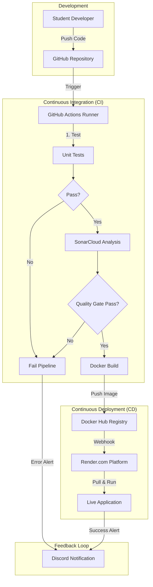

# Capstone Project Report: Automated CI/CD Pipeline

**Student Name:** Mustafa
**Project Title:** Automated CI/CD Pipeline for Student Projects
**Date:** January 2026

---

## 1. Executive Summary
This project addresses the disconnect between software development and deployment in student projects. While students are proficient in coding, they often lack the infrastructure for automated testing, quality assurance, and consistent deployment. This project implements a fully automated Continuous Integration and Continuous Deployment (CI/CD) pipeline that transforms code submission into a deployed application without manual intervention.

## 2. Problem Statement
Student development teams face several critical challenges:
*   **"It works on my machine":** Inconsistent environments lead to application failures during presentation.
*   **Lack of Quality Control:** Bugs and security vulnerabilities are often discovered too late.
*   **Manual Deployment:** The process of moving code to a server is manual, error-prone, and slow.

## 3. System Architecture
The solution utilizes a best-in-class generic architecture composed of five key stages.

## 4. Pipeline Implementation Details

### 4.1. Integration Stage (GitHub)
*   **Role:** Version Control & Trigger.
*   **Mechanism:** The pipeline is defined in `.github/workflows/ci.yml`. It triggers automatically on every `push` to the `main` branch.

### 4.2. Testing Stage (Pytest)
*   **Role:** Logic Verification.
*   **Tool:** `pytest` with `pytest-cov`.
*   **Details:** Runs unit tests to verify cryptographic algorithms. Generates a coverage report (`coverage.xml`) which is parsed to ensure code passes acceptable thresholds.

### 4.3. Quality Assurance Stage (SonarCloud)
*   **Role:** Static Application Security Testing (SAST).
*   **Tool:** SonarCloud.
*   **Checkpoints:**
    *   **Security:** Checks for hardcoded secrets or injection vulnerabilities.
    *   **Reliability:** Detects simplified code smells and potential bugs.
    *   **Maintainability:** Enforces code style and complexity limits.
    *   **Quality Gate:** The pipeline is configured to fail if the code does not meet the "Clean Code" standard.

### 4.4. Build Stage (Docker)
*   **Role:** Artifact Creation.
*   **Tool:** Docker.
*   **Process:** The application is containerized using a `Dockerfile`. This ensures that the OS, Python dependencies, and application code are bundled into a single, immutable artifact. This image is pushed to Docker Hub, serving as the "Single Source of Truth" for deployment.

### 4.5. Deployment Stage (Render)
*   **Role:** Production Environment.
*   **Tool:** Render.com (Cloud PaaS).
*   **Mechanism:** A Deploy Hook is triggered only after the Docker Image is successfully pushed. Render pulls the new image and performs a zero-downtime rollout.

### 4.6. Monitoring & Logs (Discord)
*   **Role:** Real-time visibility.
*   **Tool:** Discord Webhooks.
*   **Implementation:** A custom script constructs a rich embed with:
    *   **Commit Metadata:** Who pushed what.
    *   **Stage Status:** Pass/Fail for Tests, Scan, Build, Deploy.
    *   **Metrics:** Test Coverage % and Total Duration.
    *   **Direct Links:** To Logs (GitHub), Quality Dashboard (SonarCloud), and Live Site (Render).

## 5. Technology Stack Rationale
*   **GitHub Actions vs. Jenkins:** Chosen for its serverless nature and tight integration with the repository, eliminating the maintenance overhead of a dedicated Jenkins server suitable for student scale.
*   **Docker:** Essential for solving environment inconsistency.
*   **Django:** Selected for its built-in security features, crucial for a cryptography-focused demonstration app.

## 6. Conclusion
The project successfully demonstrates that improved software quality and delivery speed are attainable for small teams through automation. The pipeline captures errors early, standardizes the build process, and ensures that the live application is always a reflection of the latest stable code.
